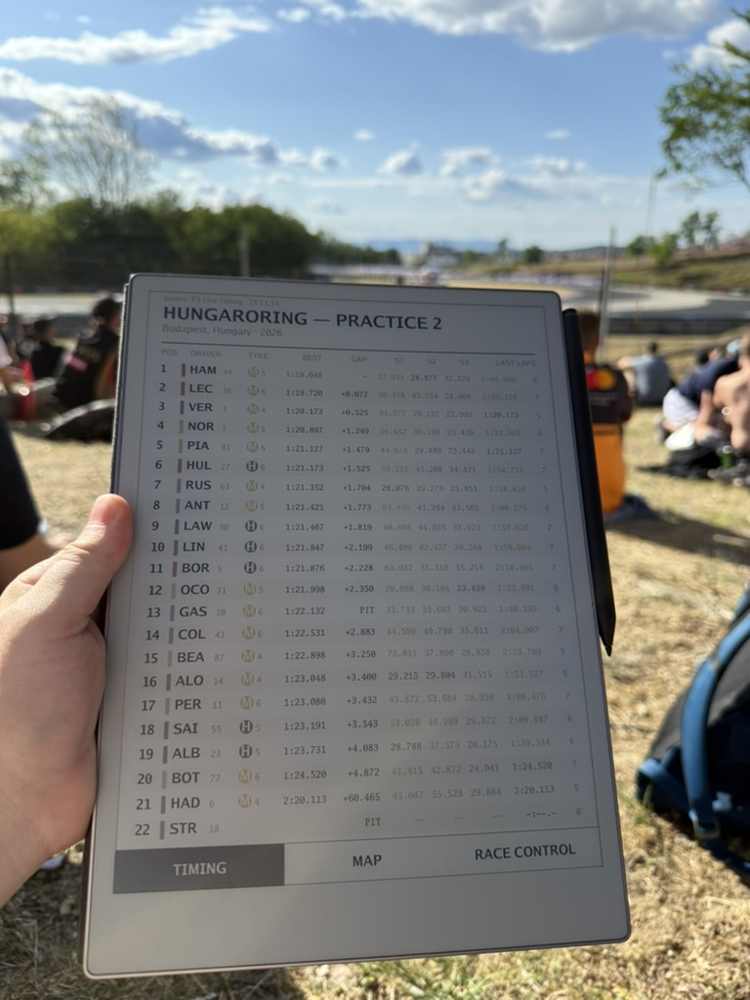
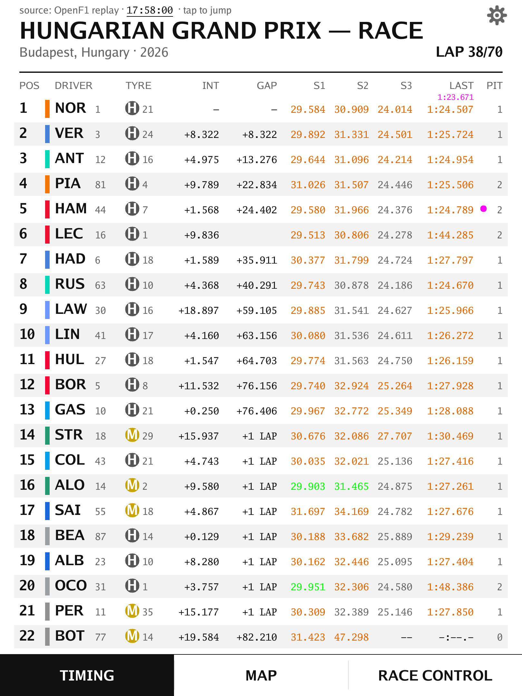
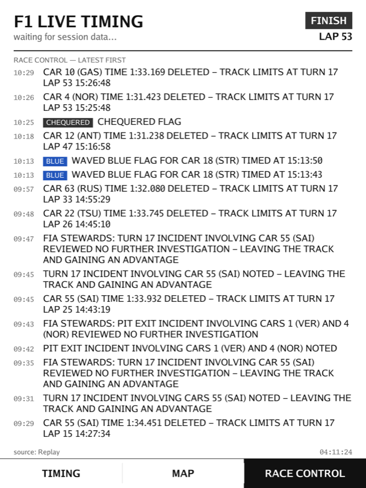

# Pit Wall

Live Formula 1 timing on your reMarkable Paper Pro's color e-ink display.
Runs as an [AppLoad](https://github.com/asivery/rmpp-appload) app (qtfb
windowed mode), so the stock reMarkable UI stays intact.

Shows for the current session: positions, intervals and gaps, last lap times, tyre compound + age, pit stop counts, track
status flags, and race control messages.

<p align="center">
  
</p>
<p align="center"><em>Live timing trackside at the Hungaroring — 2026 Practice 2.</em></p>

<p align="center">
  
  
</p>
<p align="center"><em>The timing and race control tabs, 38 laps into the 2026 Hungarian Grand Prix.</em></p>

## Data sources

- **F1 Live Timing** (`livetiming.formula1.com/signalrcore`) — the real-time
  SignalR stream used by the official app and projects like
  [FastF1](https://theoehrly-fast-f1.mintlify.app/api/livetiming),
  [undercut-f1](https://github.com/JustAman62/undercut-f1) and
  [termf1](https://github.com/dk-a-dev/termf1). Free, and no account or token
  required — the app connects to the public `/signalrcore` endpoint.
- **OpenF1** (`api.openf1.org`) — free historical/delayed data, used by
  replay mode to browse past seasons, weekends and sessions and play one
  back on-device.

## Prerequisites (one-time, on the device)

1. Enable developer mode on the Paper Pro (Settings → General → Software →
   Advanced). This factory-resets the device and enables SSH.
2. Install XOVI + AppLoad — easiest via
   [remagic](https://github.com/maximerivest/remagic), or manually per the
   AppLoad README.

## Install

Requires Go 1.22+. With the tablet connected over USB (or on the same Wi-Fi):

```sh
git clone https://github.com/sijokun/PitWall.git
cd PitWall
./deploy.sh              # USB: root@10.11.99.1
./deploy.sh 192.168.1.50 # or your device's Wi-Fi IP
```

This cross-compiles a static aarch64 binary (no reMarkable SDK needed) and
copies it plus `external.manifest.json` and `icon.png` to
`/home/root/xovi/exthome/appload/pitwall/`. The binary is copied aside
and moved into place, so a deploy works while the app is running (it picks
up the new build on the next launch). Then open AppLoad on the device and
launch Pit Wall.

No configuration is required — no account, token or API key. The one optional
variable, `F1_DNS`, is documented in `.env.example` and below.

The launcher icon is generated, not a checked-in asset:

```sh
go run ./cmd/icon                # all candidates in build/, icon.png = chequered
go run ./cmd/icon -style track   # or: track | bars
```

AppLoad draws `icon.png` at 150x150 next to the manifest, so the candidates
are flat two-tone 256x256 PNGs with no hairlines or gradients — anything
finer dithers away on the Kaleido panel.

## Usage

- **Session mode** (Settings, top section) picks what the app shows:
  - **Live** follows the push feed, redrawing as events arrive (debounced
    to ~1/s for the e-ink panel; tune with `-min-redraw`). Until a session
    is on air, an animated waiting screen shows that the app is still
    polling; timing appears by itself the moment the feed carries a
    session. RETRY reconnects.
  - **Replay** opens the OpenF1 browser: pick a season, then a race
    weekend, then a session (BACK steps up a level). Loading a
    session takes ~20 s due to API rate limits. The Grand Prix name and the
    lap counter (`LAP 32/69`, the distance taken from the session's lap
    data) are shown on top while playing. Tap the clock in the top strip to
    open the time popup and jump the replay by ±1, ±5 or ±10 minutes; the
    back arrow in Settings leaves the replay for the weekend's session list.
    Replay speed defaults to 60x (`-speed`).

  The settings gear keeps the same top-right spot on every screen.

  The chosen mode is saved, so the app comes back up in it.
- **Header line** (Settings) chooses what the header shows: the session name
  and venue, or the newest race control message — the message then takes the
  two big lines (with its flag chip, wrapping if long) and the session name
  moves to the small strip at the very top, so incidents are readable at a
  glance from any tab.
- **Fastest lap**: the session's best lap shows in purple under the `LAST`
  column, and a purple dot sits beside the lap time of the driver holding it.
  A purple `LAST` time means something narrower — that lap was fastest when it
  was set. The header time follows the Overall best times setting; the dot
  always shows.
- **Live delay (TV sync)** (Settings) holds the live feed back so timing
  matches a broadcast that runs behind the feed. It's a stepper rather than a
  fixed list — tap `-`/`+` to move the value by 1, 5 or 10 seconds, up to 10
  minutes; `OFF` (0) is realtime. Live sessions only.
- **Tabs** (bottom bar): TIMING — the leaderboard; MAP — the circuit
  outline (from the MultiViewer API) with live car positions from the
  `Position.z` feed; RACE CONTROL — the full message log with flags.
- **Yellow flags**: race control's per-sector messages ("YELLOW / DOUBLE
  YELLOW IN TRACK SECTOR 7", cleared by "CLEAR IN TRACK SECTOR 7") are
  folded into the set of marshal sectors currently flagged. The YELLOW chip
  flies top-right on every tab with the live sector list under it
  (`SECTORS 5, 7, 11`), and on the map those stretches of track are drawn
  thicker and in yellow. A green light, a track-wide clear, a red or the
  chequered flag lifts them all.
- **Tap anywhere above the tab bar** to force a deep e-ink refresh (clears
  ghosting). One is also done automatically every 3 minutes.
- **Redraws**: data updates are rate-limited by the redraw interval setting,
  but taps, screen changes and the loading animation draw immediately — the
  UI never waits out the interval to answer you. While the app is waiting on
  the server (session lists, replay downloads, a live session) a marching bar
  animates until the data lands.
- Flags: `-source auto|live|openf1` (initial session mode before any
  settings are saved: `openf1` starts in the replay browser),
  `-speed 60` (replay factor),
  `-min-redraw 1s` (set via `"args"` in `external.manifest.json` if desired).
- **DNS**: the device's `/etc/resolv.conf` is often empty or points at a
  resolver that never answers, so `api.openf1.org` and
  `livetiming.formula1.com` fail to resolve on an otherwise working network.
  The app therefore resolves through 8.8.8.8, falling back to 1.1.1.1 and
  then to any system nameservers. Override with
  `F1_DNS=9.9.9.9,149.112.112.112`, or `F1_DNS=system` to use the OS
  resolver as-is.
- Quit from the AppLoad launcher.

## Development

### Desktop simulator (live debug on Mac/PC)

`cmd/devapp` opens a native window showing the exact frames the tablet
would display (half scale); mouse clicks act as touches, so the tab bar
works like on the device:

```sh
go run ./cmd/devapp                                  # live mode (waits for a session)
go run ./cmd/devapp -source live                     # real live session
go run ./cmd/devapp -replay testdata/partial_saved_data_2025_04_06.txt \
    -speed 60 -circuit 46                            # replay at 60x, Suzuka map
```

### Single frames

Render a frame to PNG on your desktop (no tablet needed):

```sh
go run ./cmd/preview -o preview.png              # auto: live, else OpenF1
go run ./cmd/preview -source live                # force live timing
go run ./cmd/preview -source openf1 -session 9165

# a chosen point in a session rather than its finished state
go run ./cmd/preview -source openf1 -session 11342 -into 60m

# render from a recorded session (2025 Japanese GP, from f1stuff/f1-live-data)
go run ./cmd/preview -replay testdata/partial_saved_data_2025_04_06.txt
```

Record your own session file during any live session with FastF1:
`python -m fastf1.livetiming save mysession.txt`.

Layout: `qtfb/` — pure-Go client for the AppLoad shared-memory framebuffer
protocol (display updates + touch input); `livetiming/` — F1 SignalR live
timing client (delta-merging feed state); `openf1/` — OpenF1 poller;
`dnsfix/` — public-DNS resolver override; `certs/` — embedded CA bundle;
`model/` — shared leaderboard state; `ui/` — renderer (embedded Go fonts,
RGB565 output); `cmd/pitwall/` — the device app; `cmd/preview/` —
desktop preview.

## License

[MIT](LICENSE).

## Disclaimer

An unofficial, non-commercial hobby project. Not associated with, endorsed by
or affiliated with Formula 1, the FIA or reMarkable. F1, FORMULA 1 and related
marks are trademarks of Formula One Licensing BV. Installing XOVI/AppLoad and
enabling developer mode is at your own risk and may void your warranty.

## AI usage

Parts of this project — application code, documentation and the repository
setup — were written with [Claude Code](https://claude.com/claude-code)
(Anthropic). Everything is reviewed, built and tested by a human before it
lands, and the design decisions are the author's. Bugs are the author's too.
